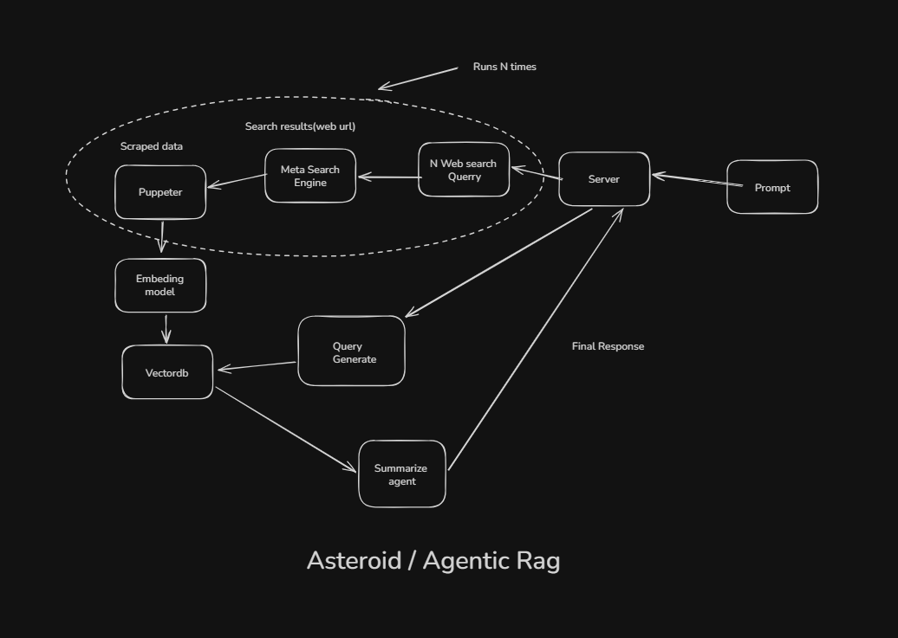

# Project Asteroid - AI-Powered Research Assistant

**Asteroid** is an intelligent web research assistant that combines agentic AI with Retrieval-Augmented Generation (RAG) to provide comprehensive, sourced answers to user questions in real-time.



---

## Overview

Asteroid transforms how users research information by leveraging AI agents to break down complex questions, search the web in parallel, and synthesize information from multiple sources with transparent source attribution.

### Key Features

- **Real-time Web Research** - Fetches and analyzes current web content
- **Multi-Query Processing** - Breaks down questions into 5 diverse search queries
- **Streaming Responses** - Displays search results and answers as they're generated
- **Source Attribution** - Shows favicon and links to all sources used
- **Dark Professional UI** - Clean, modern interface with smooth animations
- **Agentic RAG Architecture** - Intelligent agent orchestrates search and synthesis

---

## Architecture

### Agentic RAG Implementation

Traditional RAG systems follow a fixed pipeline: Query → Search → Retrieve → Generate. Asteroid uses an agentic approach:

1. **Query Decomposition** - AI agent breaks user question into 5 specialized search queries
2. **Parallel Multi-Search** - Each query searches independently, finding diverse angles
3. **Dynamic Aggregation** - Results deduplicated and accumulated in real-time
4. **Smart Synthesis** - LLM synthesizes information with full awareness of sources
5. **Streaming Delivery** - Results shown as they arrive, not after completion

Benefits:

- Comprehensive coverage of question space
- Real-time user feedback during processing
- Better handling of complex/multi-faceted questions
- Transparent search-to-answer journey

### System Architecture Diagram

```
┌─────────────────────────────────────────────────────────────┐
│                    Frontend (Next.js)                        │
│                                                               │
│  ┌─────────────────┐         ┌──────────────────────────┐   │
│  │  Chat Interface │◄────────│  Processing Steps Tracker│   │
│  │                 │         │  (Real-time progress)    │   │
│  └────────┬────────┘         └──────────────────────────┘   │
│           │                                                   │
│    SSE Streaming                                             │
│           │                                                   │
└───────────┼───────────────────────────────────────────────┘
            │
┌───────────▼───────────────────────────────────────────────┐
│              Backend (Node.js / Express)                    │
│                                                               │
│  ┌──────────────────────────────────────────────────────┐   │
│  │  Router: POST /api/agent/chat                        │   │
│  │  - Validates input                                   │   │
│  │  - Sets up SSE stream                                │   │
│  │  - Calls Multi-Node Agent                            │   │
│  └────────────────┬─────────────────────────────────────┘   │
│                   │                                           │
│  ┌────────────────▼─────────────────────────────────────┐   │
│  │  LangGraph Multi-Node Agent                          │   │
│  │                                                       │   │
│  │  Node 1: generateSearchQueries                        │   │
│  │  ├─ Uses ChatGroq LLM                                │   │
│  │  ├─ Breaks prompt into 5 queries                     │   │
│  │  └─ Emits: queries_generated event                   │   │
│  │                                                       │   │
│  │  Node 2: generateContexts                            │   │
│  │  ├─ For each query (parallel):                       │   │
│  │  │  ├─ Search web (Google Search API)                │   │
│  │  │  ├─ Emit search_results event (real-time)         │   │
│  │  │  ├─ Scrape URLs (Puppeteer)                       │   │
│  │  │  ├─ Embed chunks (ChromaDB)                       │   │
│  │  │  └─ Query for relevance (Vector similarity)       │   │
│  │  └─ Emits: search_results events (incremental)       │   │
│  │                                                       │   │
│  │  Node 3: summarizeContexts                           │   │
│  │  ├─ Combines all retrieved contexts                  │   │
│  │  ├─ LLM synthesizes answer with sources              │   │
│  │  └─ Emits: complete event                            │   │
│  │                                                       │   │
│  └──────────────────────────────────────────────────────┘   │
│           │                                                   │
│  ┌────────▼──────────────────────────────────────────────┐  │
│  │  External Services                                     │  │
│  │                                                         │  │
│  │  • Google Search API - Web search                      │  │
│  │  • Puppeteer/Brave - URL scraping                      │  │
│  │  • ChromaDB - Vector embeddings storage               │  │
│  │  • Groq LLM - Fast inference (llama-4-scout)          │  │
│  │  • Google Fonts API - Favicon service                 │  │
│  │                                                         │  │
│  └─────────────────────────────────────────────────────────┘  │
│                                                               │
└───────────────────────────────────────────────────────────────┘
`